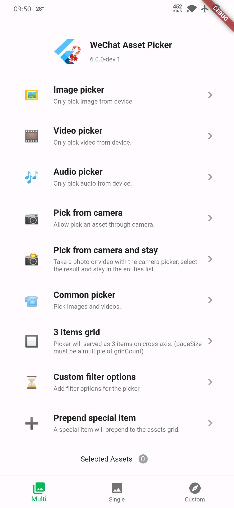
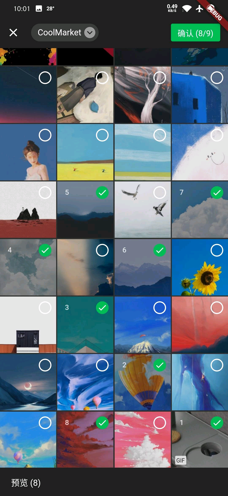
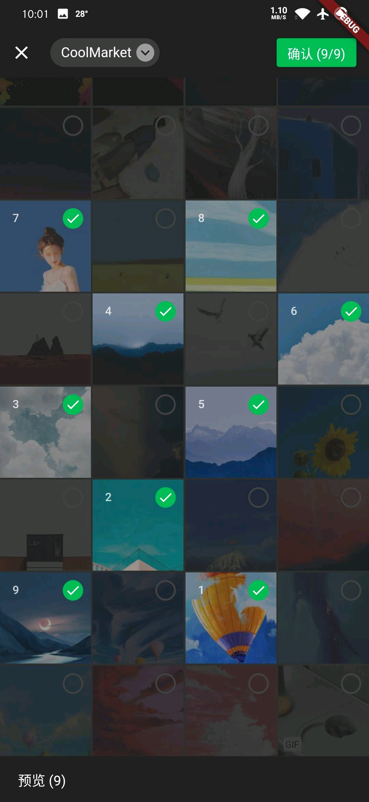
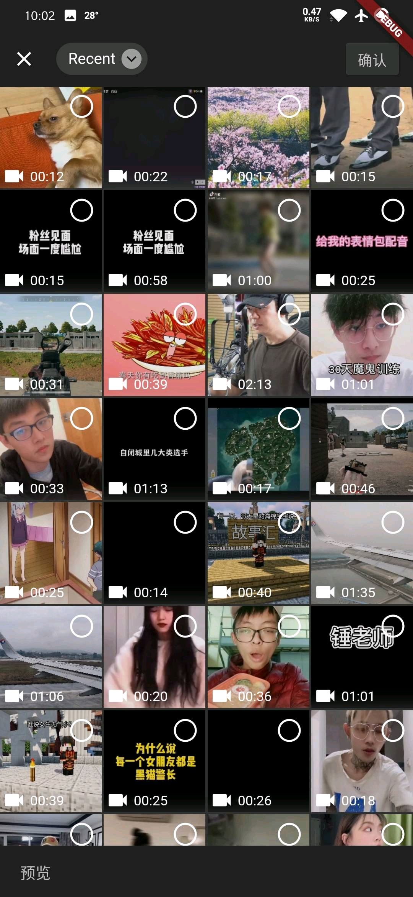
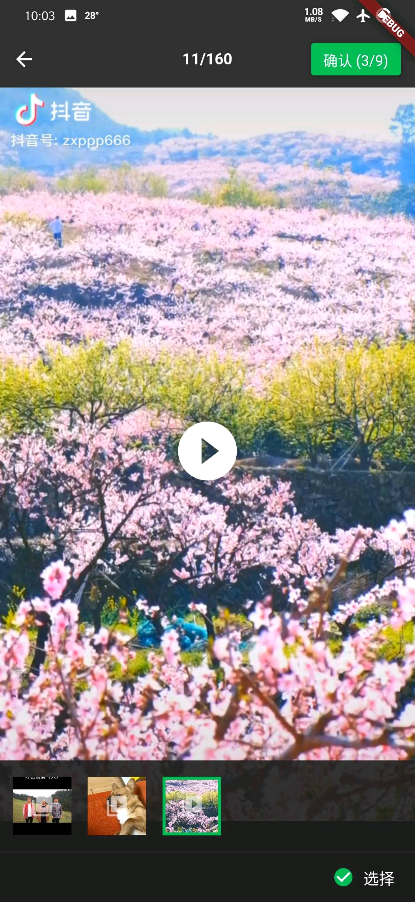
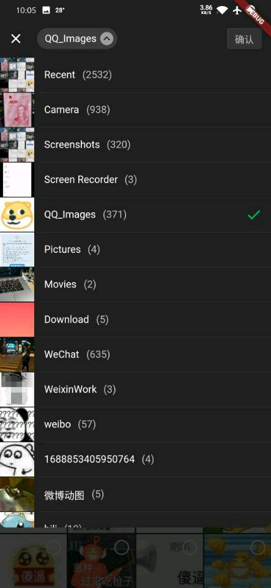
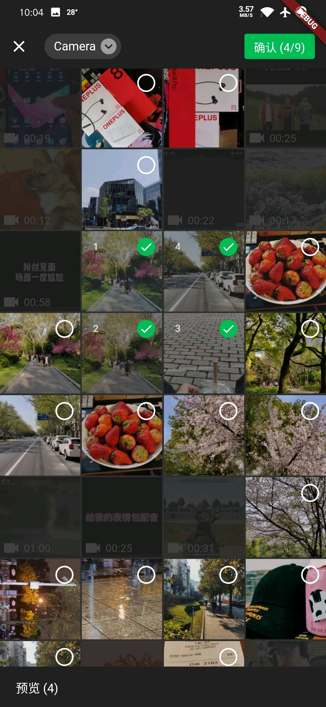
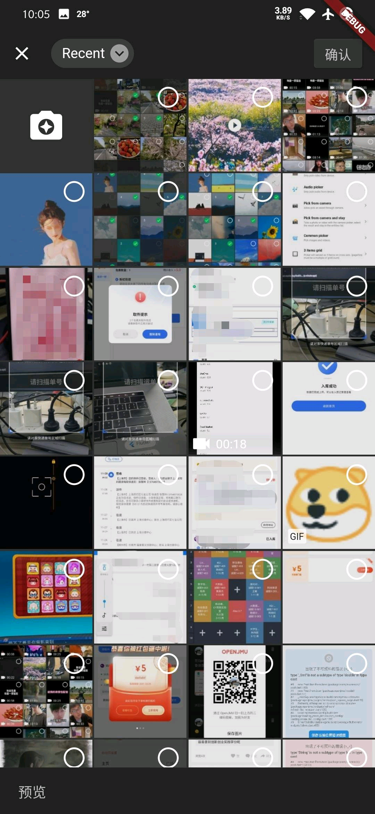
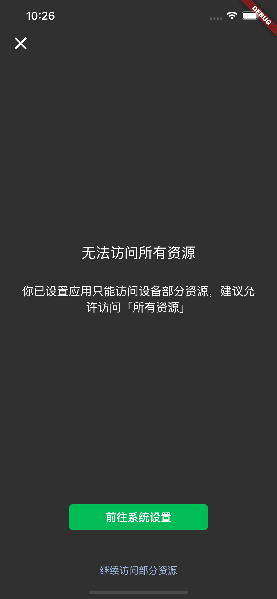
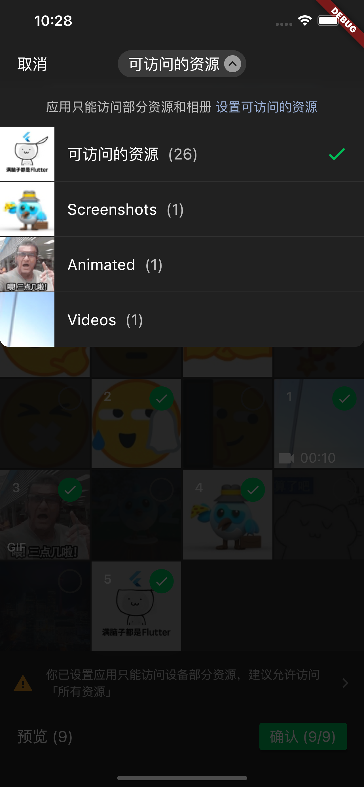

<!-- Copyright 2019 The FlutterCandies author. All rights reserved.
Use of this source code is governed by an Apache license
that can be found in the LICENSE file. -->

# Flutter WeChat Assets Picker

[](https://pub.flutter-io.cn/packages/wechat_assets_picker)
[](https://pub.flutter-io.cn/packages/wechat_assets_picker)
[](https://www.codefactor.io/repository/github/fluttercandies/flutter_wechat_assets_picker)

[](https://github.com/fluttercandies/flutter_wechat_assets_picker/actions/workflows/runnable.yml)
[](https://github.com/fluttercandies/flutter_wechat_assets_picker/blob/main/LICENSE)
[](https://github.com/fluttercandies/flutter_wechat_assets_picker/stargazers)
[](https://github.com/fluttercandies/flutter_wechat_assets_picker/network)

[](https://github.com/Solido/awesome-flutter)
<a href="https://qm.qq.com/q/ZyJbSVjfSU"></a>

Language: [English](README.md) | 中文

基于 **微信 UI** 的 Flutter **图片选择器（同时支持视频和音频）**。

当前的界面设计基于的微信版本：**8.0.51**
界面更新将在微信版本更新后随时进行跟进。

如果你需要拍照及录制视频，请先查看示例的详细用法，
并前往 [wechat_camera_picker][wechat_camera_picker pub]。
该插件是独立扩展，需要结合使用。

查看 [迁移指南][] 了解如何从破坏性改动中迁移为可用代码。

## 版本兼容

该插件仅保证能与 **stable 渠道的 Flutter SDK** 配合使用。
我们不会为其他渠道的 Flutter SDK 做实时支持。

|        | 3.7 | 3.10 | 3.13 | 3.16 | 3.22 |
|--------|:---:|:----:|:----:|:----:|:----:|
| 9.5.0+ |  ❌  |  ❌   |  ❌   |  ❌   |  ✅   |
| 8.9.0+ |  ❌  |  ❌   |  ❌   |  ✅   |  ❌   |
| 8.7.0+ |  ❌  |  ❌   |  ✅   |  ❌   |  ❌   |
| 8.5.0+ |  ❌  |  ✅   |  ❌   |  ❌   |  ❌   |
| 8.4.0+ |  ✅  |  ❌   |  ❌   |  ❌   |  ❌   |

如果在 `flutter pub get` 时遇到了 `resolve conflict` 失败问题，
请使用 `dependency_overrides` 解决。

## 主要使用的 package

该插件基于这些优秀的 package 构建：

| Name                                 | Features      |
|:-------------------------------------|:--------------|
| [photo_manager][photo_manager pub]   | 资源的基础抽象和管理。   |
| [extended_image][extended_image pub] | 以熟悉的操作预览所有资源。 |
| [provider][provider pub]             | 协助选择器管理器内部状态。 |
| [video_player][video_player pub]     | 播放对应的视频和音频。   |

这些 package 在该插件中的实现已相对稳定。
如果你在使用中发现于它们相关的问题，
请先在本插件的问题跟踪中报告相关问题。

<details>
  <summary>目录列表</summary>

<!-- TOC -->
* [Flutter WeChat Assets Picker](#flutter-wechat-assets-picker)
  * [版本兼容](#版本兼容)
  * [主要使用的 package](#主要使用的-package)
  * [特性 ✨](#特性-)
    * [特别提醒 📝](#特别提醒-)
  * [项目展柜 🖼️](#项目展柜-)
  * [截图 📸](#截图-)
  * [开始前的注意事项 ‼️](#开始前的注意事项-)
  * [准备工作 🍭](#准备工作-)
    * [Flutter](#flutter)
    * [Android](#android)
      * [权限](#权限)
    * [iOS](#ios)
    * [macOS](#macos)
  * [使用方法 📖](#使用方法-)
    * [国际化](#国际化)
    * [简单的使用方法](#简单的使用方法)
    * [更详细的使用方法](#更详细的使用方法)
      * [展示选中的资源](#展示选中的资源)
      * [注册资源变化回调](#注册资源变化回调)
      * [在表单数据中上传 `AssetEntity`](#在表单数据中上传-assetentity)
        * [使用 `http`](#使用-http)
        * [使用 `dio`](#使用-dio)
    * [自定义选择器](#自定义选择器)
  * [常见问题 ❔](#常见问题-)
    * [修改默认相册名称（将 `Recent` 改为其他）](#修改默认相册名称将-recent-改为其他)
    * [Execution failed for task ':photo_manager:compileDebugKotlin'](#execution-failed-for-task-photo_managercompiledebugkotlin)
    * [从 `File` 或 `Uint8List` 创建 `AssetEntity` 的方法](#从-file-或-uint8list-创建-assetentity-的方法)
    * [控制台提示 'Failed to find GeneratedAppGlideModule'](#控制台提示-failed-to-find-generatedappglidemodule)
  * [致谢](#致谢)
<!-- TOC -->
</details>

## 特性 ✨

- ♿ 完整的无障碍支持，包括 **TalkBack** 和 **VoiceOver**
- ♻️ 支持基于代理重载的全量自定义
- 🎏 完全可自定义的基于 `ThemeData` 的主题
- 💚 复刻微信风格（甚至优化了更多的细节）
- ⚡️ 根据配置调节的性能优化
- 📷 图片资源支持
  - 🔬 HEIF 格式图片支持 <a href="#特别提醒-"><sup>(1)</sup></a>
- 🎥 视频资源支持
- 🎶 音频资源支持 <a href="#notes-"><sup>(2)</sup></a>
- 1️⃣ 单选模式模式
- 💱 国际化 (i18n) 支持
  - ⏪ RTL 语言支持
- ➕ 特殊 widget 构建支持
- 🗂 自定义路径排序支持
- 📝 自定义文本构建支持
- ⏳ 自定义筛选规则支持
- 💻 支持 MacOS

### 特别提醒 📝

1. HEIF (HEIC) 图片支持获取和转换，但是它们的显示依托于 Flutter 的图片解析。
   在此 issue 中 [flutter/flutter#20522](https://github.com/flutter/flutter/issues/20522) 有所说明。
   若要用于显示，请使用 `entity.file` 或 `AssetEntityImage` 进行处理。
2. 由于 iOS 和 macOS 的系统限制，在获取音频时只能获取应用沙盒环境内的音频。

## 项目展柜 🖼️

| name                | pub                                                                                                                        | github                                                                                                                                        |
|:--------------------|:---------------------------------------------------------------------------------------------------------------------------|:----------------------------------------------------------------------------------------------------------------------------------------------|
| insta_assets_picker | [](https://pub.flutter-io.cn/packages/insta_assets_picker) | [](https://github.com/LeGoffMael/insta_assets_picker) |

## 截图 📸

|    |    |    |
|-----------------------------------|-----------------------------------|-----------------------------------|
|    |    |    |
|    |    |    |
|  |  |  |

## 开始前的注意事项 ‼️

在开始一切之前，请明确以下两点：
- 由于理解差异和篇幅限制，并不是所有的内容都会明确地在文档中指出。
  当你遇到没有找到需求和无法理解的概念时，请先运行项目的示例 example，
  它可以解决 90% 的常见需求。
- 该库与 [photo_manager][photo_manager pub] 有强关联性，
  大部分方法的行为是由 photo_manager 进行控制的，
  所以请尽可能地确保你了解以下两个类的概念：
  - 资源（图片/视频/音频） [`AssetEntity`](https://pub.flutter-io.cn/documentation/photo_manager/latest/photo_manager/AssetEntity-class.html)
  - 资源合集（相册或集合概念） [`AssetPathEntity`](https://pub.flutter-io.cn/documentation/photo_manager/latest/photo_manager/AssetPathEntity-class.html)

当你有与相关的 API 和行为的疑问时，你可以查看
[photo_manager API 文档][] 了解更多细节。

众多使用场景都已包含在示例中。
在你提出任何问题之前，请仔细并完整地查看和使用示例。

## 准备工作 🍭

### Flutter

执行 `flutter pub add wechat_assets_picker`，
或者将 `wechat_assets_picker` 手动添加至 `pubspec.yaml` 引用。

```yaml
dependencies:
  wechat_assets_picker: ^latest_version
```

最新的 **稳定** 版本是:
[](https://pub.flutter-io.cn/packages/wechat_assets_picker)

最新的 **开发** 版本是:
[](https://pub.flutter-io.cn/packages/wechat_assets_picker)

在你的代码中导入：

```dart
import 'package:wechat_assets_picker/wechat_assets_picker.dart';
```

### Android

在使用这个 package 时，请确保
`compileSdkVersion` 和 `targetSdkVersion` 升级到 `33`。
否则，在 Android 13 设备上将有可能无法加载任何资源。

#### 权限

| Name                     | 必需  | 已声明 | 最高 API 版本 | 其他          |
|--------------------------|-----|-----|-----------|-------------|
| `READ_EXTERNAL_STORAGE`  | 是   | 是   | 32        |             |
| `WRITE_EXTERNAL_STORAGE` | 否   | 否   | 29        |             |
| `ACCESS_MEDIA_LOCATION`  | 是*  | 否   | N/A       | 读取 EXIF 时必需 |
| `READ_MEDIA_IMAGES`      | 是*  | 是   | N/A       | 读取图片时必需     | 
| `READ_MEDIA_VIDEO`       | 是*  | 是   | N/A       | 读取视频时必需     | 
| `READ_MEDIA_AUDIO`       | 是*  | 是   | N/A       | 读取音频时必需     |

如果你的目标 SDK 版本大于 33，且你不需要获取图片、视频或者音频，
你可以考虑只声明需要的权限，具体如下：

```xml
<manifest xmlns:android="http://schemas.android.com/apk/res/android"
    xmlns:tools="http://schemas.android.com/tools"
    package="com.your.app">
    <!--请求图片和视频权限-->
    <uses-permission android:name="android.permission.READ_MEDIA_IMAGES" />
    <uses-permission android:name="android.permission.READ_MEDIA_VIDEO" />
    <!--如果不需要获取音频，移除或者注释 READ_MEDIA_AUDIO-->
    <!--<uses-permission android:name="android.permission.READ_MEDIA_AUDIO" />-->
</manifest>
```

### iOS

1. 在 `ios/Podfile` 中指定最低构建版本至 **11.0**。
   ```ruby
   platform :ios, '11.0'
   ```
   如果该行以 `#` (注释) 开头，请把 `#` 删除。
2. 将以下内容添加至 `Info.plist`。
```
<key>NSPhotoLibraryUsageDescription</key>
<string>你的相册权限描述</string>
```

### macOS

1. 在 `macos/Podfile` 中指定最低构建版本至 **10.15**。
   ```Podfile
   platform :osx, '10.15'
   ```
   如果该行以 `#` (注释) 开头，请把 `#` 删除。
2. 使用 **Xcode** 打开 `macos/Runner.xcworkspace`。
   接着将 macOS 的最低构建版本提升至 **10.15**。
3. 与 [iOS](#iOS) 一样，添加相同的内容到 `Info.plist` 里。

## 使用方法 📖

### 国际化

当你在选择资源的时候，package 会通过你的 `BuildContext`
读取 `Locale?`，返回对应语言的文字代理实现。
请确保你可以通过 `BuildContext` 获取到 `Locale`，否则将会 **默认展示中文文字**。

内置的语言文字实现有：
* 简体中文 (默认)
* English
* העברית
* Deutsche
* Локализация
* 日本語
* مة العربية
* Délégué
* Tiếng Việt
* Türkçe Yerelleştirme

如果你想使用自定义或固定的文字实现，请通过
`AssetPickerConfig.textDelegate` 传递调用。

### 简单的使用方法

```dart
final List<AssetEntity>? result = await AssetPicker.pickAssets(context);
```

你可以使用 `AssetPickerConfig` 来调整选择时的行为。

```dart
final List<AssetEntity>? result = await AssetPicker.pickAssets(
  context,
  pickerConfig: const AssetPickerConfig(),
);
```

`AssetPickerConfig` 的成员说明：

| 参数名                               | 类型                                               | 描述                                                   | 默认值                         |
|-----------------------------------|--------------------------------------------------|------------------------------------------------------|-----------------------------|
| selectedAssets                    | `List<AssetEntity>?`                             | 已选的资源。确保不重复选择。                                       | `null`                      |
| maxAssets                         | `int`                                            | 最多选择的图片数量                                            | 9                           |
| pageSize                          | `int`                                            | 分页加载时每页加载的资源数量。**必须为网格数的倍数。                          | 80                          |
| gridThumbnailSize                 | `ThumbnailSize`                                  | 预览网格的缩略图大小                                           | `ThumbnailSize.square(200)` |
| pathThumbnailSize                 | `ThumbnailSize`                                  | 路径选择器的缩略图大小                                          | `ThumbnailSize.square(80)`  |
| previewThumbnailSize              | `ThumbnailSize?`                                 | 预览时图片的缩略图大小                                          | `null`                      |
| requestType                       | `RequestType`                                    | 选择器选择资源的类型                                           | `RequestType.common`        |
| specialPickerType                 | `SpecialPickerType?`                             | 提供一些特殊的选择器类型以整合非常规的选择行为                              | `null`                      |
| keepScrollOffset                  | `bool`                                           | 选择器是否可以从同样的位置开始选择                                    | `null`                      |
| sortPathDelegate                  | `SortPathDelegate<AssetPathEntity>?`             | 资源路径的排序实现，可自定义路径排序方法                                 | `CommonSortPathDelegate`    |
| sortPathsByModifiedDate           | `bool`                                           | 是否结合 `FilterOptionGroup.containsPathModified` 进行路径排序 | `false`                     |
| filterOptions                     | `PMFilter?`                                      | 允许用户自定义资源过滤条件                                        | `null`                      |
| gridCount                         | `int`                                            | 选择器网格数量                                              | 4                           |
| themeColor                        | `Color?`                                         | 选择器的主题色                                              | `Color(0xff00bc56)`         |
| pickerTheme                       | `ThemeData?`                                     | 选择器的主题提供，包括查看器                                       | `null`                      |
| textDelegate                      | `AssetPickerTextDelegate?`                       | 选择器的文本代理构建，用于自定义文本                                   | `AssetPickerTextDelegate()` |
| specialItemPosition               | `SpecialItemPosition`                            | 允许用户在选择器中添加一个自定义item，并指定位置。                          | `SpecialPosition.none`      |
| specialItemBuilder                | `SpecialItemBuilder?`                            | 自定义item的构造方法                                         | `null`                      |
| loadingIndicatorBuilder           | `IndicatorBuilder?`                              | 加载器的实现                                               | `null`                      |
| selectPredicate                   | `AssetSelectPredicate`                           | 判断资源可否被选择                                            | `null`                      |
| shouldRevertGrid                  | `bool?`                                          | 判断资源网格是否需要倒序排列                                       | `null`                      |
| limitedPermissionOverlayPredicate | `LimitedPermissionOverlayPredicate?`             | 判断有限的权限情况下是否展示提示页面                                   | `null`                      |
| pathNameBuilder                   | `PathNameBuilder<AssetPathEntity>?`              | 基于路径（相册）构建自定义名称的方法                                   | `null`                      |
| assetsChangeCallback              | `AssetsChangeCallback<AssetPathEntity>?`         | 当系统通知资源变化时将调用的回调                                     | `null`                      |
| assetsChangeRefreshPredicate      | `AssetsChangeRefreshPredicate<AssetPathEntity>?` | 判断资源变化是否根据 call 和当前选中的路径进行更新                         | `null`                      |
| shouldAutoplayPreview             | `bool`                                           | 预览是否应自动播放                                            | `false`                     |
| dragToSelect                      | `bool`                                           | 是否开启拖拽选择                                             | `true`                      |

- 当 `maxAssets` 等于 `1`（即单选模式），搭配
  `SpecialPickerType.noPreview` 使用会在用户点选资源换时立刻选中并返回。
- `limitedPermissionOverlayPredicate` 不是持久化的，
  如果你需要在应用下次启动时不再显示权限受限的页面，请自主实现持久化的控制。

### 更详细的使用方法

我们已将常用的调用方法封装在 [example](example) 中。
你可以在 `example/lib/pages/multi_assets_page.dart` 和
`example/lib/pages/single_assets_page.dart`
找到 `List<PickMethod> pickMethods`，
它分别定义了多选和单选可用的选择模式。
在选择资源后，资源会暂存并展示在页面下方。

#### 展示选中的资源

`AssetEntityImage` 和 `AssetEntityImageProvider`
可以为 **图片 & 视频** 展示缩略图，以及展示 **图片的原图**。
它的使用方法与常见的 `Image` 和 `ImageProvider` 一致。

```dart
AssetEntityImage(asset, isOriginal: false);
```

或：

```dart
/// AssetEntityImageProvider
Image(image: AssetEntityImageProvider(asset, isOriginal: false));
```

#### 注册资源变化回调

```dart
/// 注册回调
AssetPicker.registerObserve();

/// 取消注册回调
AssetPicker.unregisterObserve();
```

#### 在表单数据中上传 `AssetEntity`

`AssetEntity` 包含有多种 I/O 相关的方法可以用于上传。
**请注意，I/O 相关的方法会消耗性能（通常是时间和内存），它们不应该被频繁调用。**

##### 使用 `http`

`http` package: https://pub.flutter-io.cn/packages/http

`http` package 使用v
[`MultipartFile`](https://pub.flutter-io.cn/documentation/http/latest/http/MultipartFile-class.html)
来在请求中处理文件。

示例代码如下：
```dart
import 'package:http/http.dart' as http;

Future<void> upload() async {
  final entity = await obtainYourEntity();
  final uri = Uri.https('example.com', 'create');
  final request = http.MultipartRequest('POST', uri)
    ..fields['test_field'] = 'test_value'
    ..files.add(await multipartFileFromAssetEntity(entity));
  final response = await request.send();
  if (response.statusCode == 200) {
    print('Uploaded!');
  }
}

Future<http.MultipartFile> multipartFileFromAssetEntity(AssetEntity entity) async {
  http.MultipartFile mf;
  // Using the file path.
  final file = await entity.file;
  if (file == null) {
    throw StateError('Unable to obtain file of the entity ${entity.id}.');
  }
  mf = await http.MultipartFile.fromPath('test_file', file.path);
  // Using the bytes.
  final bytes = await entity.originBytes;
  if (bytes == null) {
    throw StateError('Unable to obtain bytes of the entity ${entity.id}.');
  }
  mf = http.MultipartFile.fromBytes('test_file', bytes);
  return mf;
}
```

##### 使用 `dio`

`dio` package: https://pub.flutter-io.cn/packages/dio

`dio` package 同样使用了
[`MultipartFile`](https://pub.flutter-io.cn/documentation/dio/latest/dio/MultipartFile-class.html)
来在请求中处理文件。

示例代码：
```dart
import 'package:dio/dio.dart' as dio;

Future<void> upload() async {
  final entity = await obtainYourEntity();
  final uri = Uri.https('example.com', 'create');
  final response = dio.Dio().requestUri(
    uri,
    data: dio.FormData.fromMap({
      'test_field': 'test_value',
      'test_file': await multipartFileFromAssetEntity(entity),
    }),
  );
  print('Uploaded!');
}

Future<dio.MultipartFile> multipartFileFromAssetEntity(AssetEntity entity) async {
  dio.MultipartFile mf;
  // Using the file path.
  final file = await entity.file;
  if (file == null) {
    throw StateError('Unable to obtain file of the entity ${entity.id}.');
  }
  mf = await dio.MultipartFile.fromFile(file.path);
  // Using the bytes.
  final bytes = await entity.originBytes;
  if (bytes == null) {
    throw StateError('Unable to obtain bytes of the entity ${entity.id}.');
  }
  mf = dio.MultipartFile.fromBytes(bytes);
  return mf;
}
```

### 自定义选择器

`AssetPickerBuilderDelegate`、`AssetPickerViewerBuilderDelegate`、
`AssetPickerProvider` 及 `AssetPickerViewerProvider` 均已暴露且可重载。
使用者可以使用自定义的泛型类型 `<A: 资源, P: 路径>`，
配合继承与重载，实现对应抽象类和类中的方法。
更多用法请查看示例中的 `Custom` 页面，
该页面包含一个以 `<File, Directory>` 为类型基础的选择器。

想要了解如何完全自定义主题、widget 和布局，前往 [示例](example/lib/customs/pickers)
查看已有的自定义选择器的实现。

如果你觉得你的实现有价值或能帮助到其他人，欢迎以 PR 的形式进行提交。
更多细节请阅读 [贡献自定义实现][]。

## 常见问题 ❔

### 修改默认相册名称（将 `Recent` 改为其他）

在 Android 上 `Recent` 是总相册的默认名称，
总相册是一个实际不存在的概念，它只是原始媒体数据的记录集合。

想要在 Android 上解决这个问题，你可以像这样使用 `pathNameBuilder`：
```dart
AssetPickerConfig(
  pathNameBuilder: (AssetPathEntity path) => switch (path) {
    final p when p.isAll => '最近',
    // 你也可以将类似的逻辑应用在其他常见的相册上。
    _ => path.name,
  },
)
```

其他相册或者其他平台 (iOS/macOS) 上的相册会根据系统语言和配置支持的语言来进行展示。
`pathNameBuilder` 可以用于任何的相册。

### Execution failed for task ':photo_manager:compileDebugKotlin'

查看 [photo_manager#561][] 了解详细的解决方法。

### 从 `File` 或 `Uint8List` 创建 `AssetEntity` 的方法

如果需要使用此库结合一些拍照需求，
可通过以下方法将 `File` 或 `Uint8List` 转为 `AssetEntity`。

```dart
final File file = your_file; // 你的 File 对象
final String path = file.path;
final AssetEntity fileEntity = await PhotoManager.editor.saveImageWithPath(
  path,
  title: basename(path),
); // 存入手机并生成 AssetEntity

final Uint8List data = your_data; // 你的 Uint8List 对象
final AssetEntity imageEntity = await PhotoManager.editor.saveImage(
  file.path,
  title: '带有后缀的名称.jpg',
); // 存入手机并生成 AssetEntity
```

**注意：如果不想保留文件，请尽量用 `File` 承载中间操作，**
否则在调用 `AssetEntity` 的删除时，系统可能会触发弹窗：

```dart
final List<String> result = await PhotoManager.editor.deleteWithIds(
  <String>[entity.id],
);
```

你可以阅读 [photo_manager#from-raw-data][]
和 [photo_manager#delete-entities][]
了解更多细节。

### 控制台提示 'Failed to find GeneratedAppGlideModule'

```
W/Glide   (21133): Failed to find GeneratedAppGlideModule. 
                   You should include an annotationProcessor compile dependency on com.github.bumptech.glide:compiler
                   in you application ana a @GlideModule annotated AppGlideModule implementation
                   or LibraryGlideModules will be silently ignored.
```

`Glide` 通过注解来保证单例，防止单例或版本之间的冲突，
而因为 `photo_manager` 使用了 `Glide` 提供部分图片功能，
所以使用它的项目必须实现自己的 `AppGlideModule`。
请移步 [Glide Generated API 文档][] 了解如何实现。

## 致谢

> IntelliJ IDEA 的每个方面都旨在最大化开发者生产力。结合智能编码辅助与符合人体工程学的设计，让开发不仅高效，更成为一种享受。

感谢 [JetBrains](https://www.jetbrains.com/?from=fluttercandies)
为开源项目提供免费的
[IntelliJ IDEA](https://www.jetbrains.com/idea/?from=fluttercandies)
等 IDE 的授权。

[](https://www.jetbrains.com/?from=fluttercandies)


[photo_manager pub]: https://pub.flutter-io.cn/packages/photo_manager
[extended_image pub]: https://pub.flutter-io.cn/packages/extended_image
[provider pub]: https://pub.flutter-io.cn/packages/provider
[video_player pub]: https://pub.flutter-io.cn/packages/video_player
[wechat_camera_picker pub]: https://pub.flutter-io.cn/packages/wechat_camera_picker
[迁移指南]: https://github.com/fluttercandies/flutter_wechat_assets_picker/blob/main/guides/migration_guide.md
[photo_manager API 文档]: https://pub.flutter-io.cn/documentation/photo_manager/latest/
[Glide Generated API 文档]: https://muyangmin.github.io/glide-docs-cn/doc/generatedapi.html
[贡献自定义实现]: https://github.com/fluttercandies/flutter_wechat_assets_picker/blob/main/example/lib/customs/CONTRIBUTING.md
[photo_manager#561]: https://github.com/fluttercandies/flutter_photo_manager/issues/561
[photo_manager#from-raw-data]: https://github.com/fluttercandies/flutter_photo_manager#from-raw-data
[photo_manager#delete-entities]: https://github.com/fluttercandies/flutter_photo_manager#delete-entities
