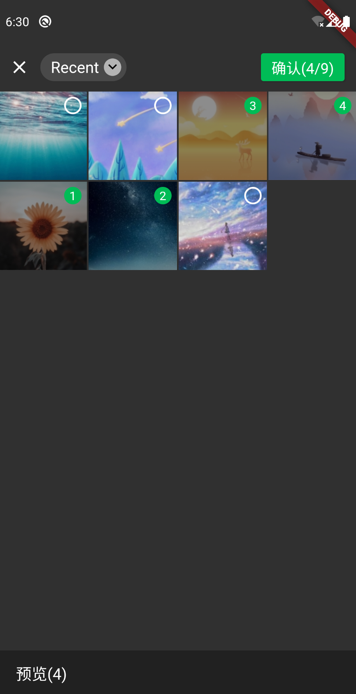
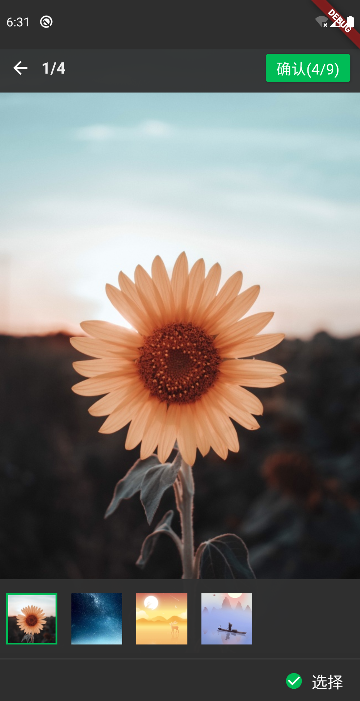

# Flutter WeChat Assets Picker

[](https://pub.dev/packages/wechat_assets_picker)
[](https://github.com/fluttercandies/flutter_wechat_assets_picker/stargazers)
[](https://github.com/fluttercandies/flutter_wechat_assets_picker/network)
[](https://github.com/fluttercandies/flutter_wechat_assets_picker/blob/master/LICENSE)
<a target="_blank" href="https://jq.qq.com/?_wv=1027&k=5bcc0gy"></a>

Language: English | [中文简体](README-ZH.md)

An assets picker which looks like the one in WeChat, based on `photo_manager` for asset implementation, `extended_image` for image preview, `provider` to help controlling the state of the picker.

## Category 🗂

* [Features](#features-)
* [Screenshots](#screenshots-)
* [TODO](#todo-)
* [Preparing for use](#preparing-for-use-)
  * [Flutter](#flutter)
  * [Android](#android)
  * [iOS](#ios)
* [Usage](#usage-)
  * [Simple usage](#simple-usage)
  * [Complete param usage](#complete-param-usage)

## Features ✨

- 💚 99% simillar to WeChat style.
- 🌠 Support multi assets pick.
- 🔍 Support asset preview. (Image / Video)

## TODO 📅

- [x] Image asset support
  - [ ] Image editing (Cut/Rotate/Draw)
- [x] Video asset support
  - [ ] Video editing support
- [ ] Audio asset support
- [ ] Single asset mode
- [x] i18n support
- [x] Custom text delegate support
- [ ] Flutter For the Web support

## Screenshots 📸




## Preparing for use 🍭

### Flutter

Add `wechat_assets_picker` to `pubspec.yaml` dependencies.
```yaml
dependencies:
  wechat_assets_picker: $latest_version
```
Then import the package in your code:
```dart
import 'package:wechat_assets_picker/wechat_assets_picker.dart';
```

### Android

You need at lease three permissions: `INTERNET` `READ_EXTERNAL_STORAGE` `WRITE_EXTERNAL_STORAGE`.

### iOS

Add following content to `info.plist`.

```
<key>NSAppTransportSecurity</key>
<dict>
	<key>NSAllowsArbitraryLoads</key>
  <true/>
</dict>
<key>NSPhotoLibraryUsageDescription</key>
<string>Replace with your permission description.</string>
```


## Usage 📖

| Name           | Type                | Description                                                  | Default                             |
| -------------- | ------------------- | ------------------------------------------------------------ | ----------------------------------- |
| context        | `BuildContext`      | Context for navigator push.                                  | `null`                              |
| maxAssets      | `int`               | Maximum asset that the picker can pick.                      | 9                                   |
| pageThumbSize  | `int`               | The size of thumb data in picker.                            | 80                                  |
| gridCount      | `int`               | Grid count in picker.                                        | 4                                   |
| requestType    | `RequestType`       | Request type for picker.                                     | RequestType.image                   |
| selectedAssets | `List<AssetEntity>` | Selected assets. Prevent duplicate selection. If you don't need to prevent duplicate selection, just don't pass it. | `null`                              |
| themeColor     | `Color`             | Main theme color for the picker                              | `Color(0xff00bc56)`                 |
| textDelegate   | `TextDelegate`      | Text delegate for the picker, for customize the texts.       | `DefaultTextDelegate()`             |
| routeCurve     | `Curve`             | The curve which the picker use to build page route transition. | `Curves.easeIn`                     |
| routeDuration  | `Duration`          | The duration which the picker use to build page route transition. | `const Duration(milliseconds: 500)` |

### Simple usage
```dart
final List<AssetEntity> assets = await AssetPicker.pickAssets(context);
```

or

```dart
AssetPicker.pickAsset(context).then((List<AssetEntity> assets) {
  /.../
});
```

### Complete param usage

```dart
List<AssetEntity> assets = <AssetEntity>{};

final List<AssetEntity> result = await AssetPicker.pickAssets(
  context,
  maxAssets: 9,
  pageThumbSize: 80,
  gridCount: 4,
  requestType: RequestType.image,
  selectedAssets: assets,
  themeColor: Colors.cyan,
  textDelegate: DefaultTextDelegate(),
  routeCurve: Curves.easeIn,
  routeDuration: const Duration(milliseconds: 500),
);
```

or

```dart
List<AssetEntity> assets = <AssetEntity>{};

AssetPicker.pickAssets(
  context,
  maxAssets: 9,
  pageThumbSize: 80,
  gridCount: 4,
  requestType: RequestType.image,
  selectedAssets: assets,
  themeColor: Colors.cyan,
  textDelegate: DefaultTextDelegate(),
  routeCurve: Curves.easeIn,
  routeDuration: const Duration(milliseconds: 500),
).then((List<AssetEntity> assets) {
  /.../
});
```

