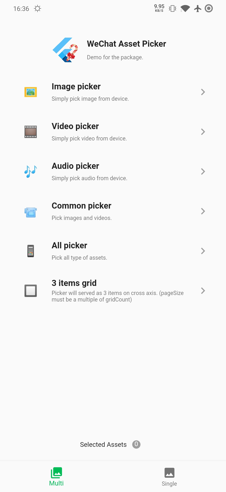
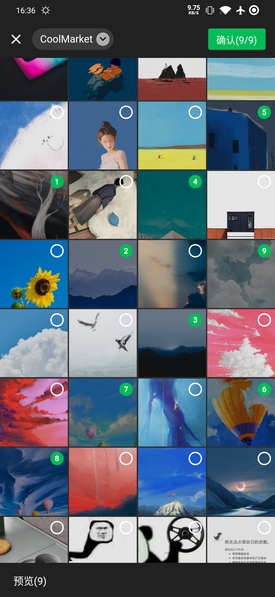
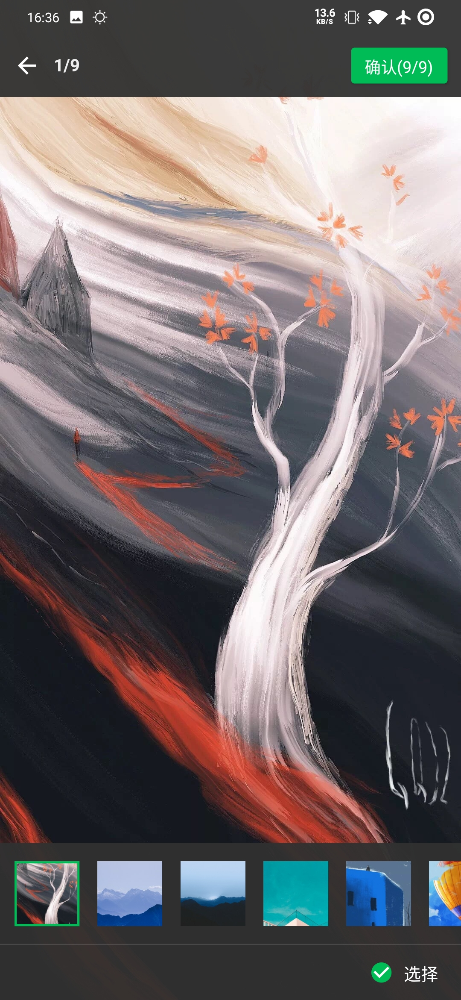
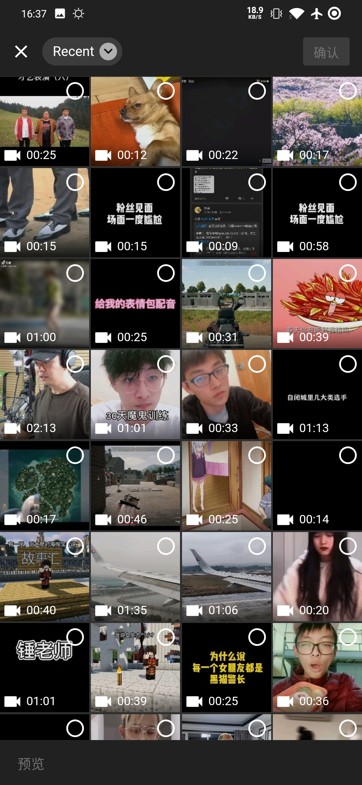
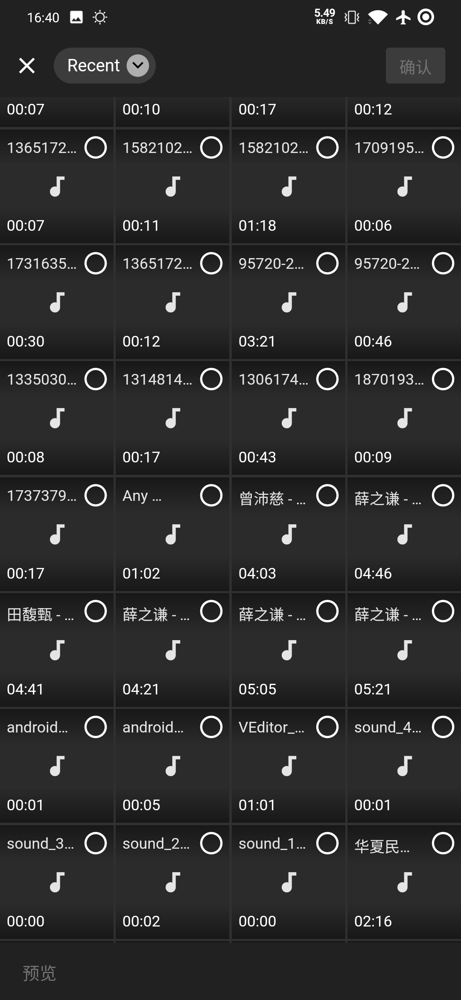
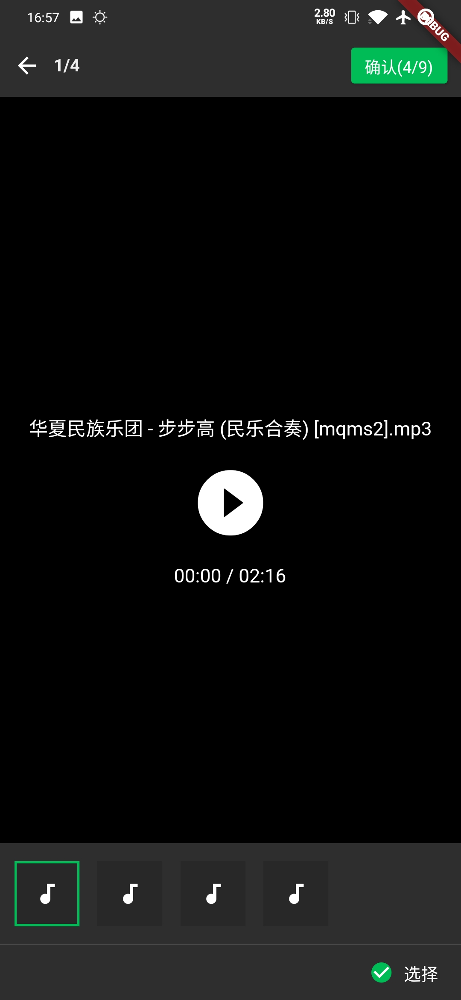
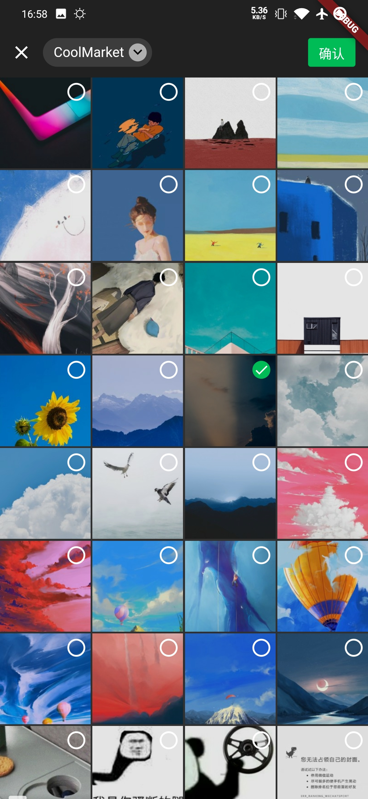
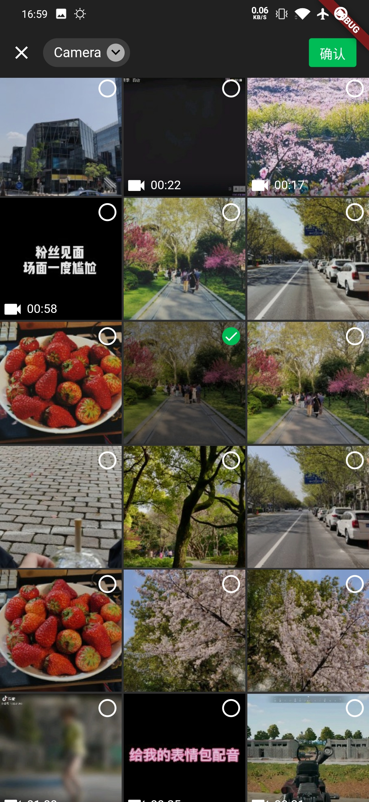

# Flutter WeChat Assets Picker

[](https://pub.dev/packages/wechat_assets_picker)
[](https://pub.dev/packages/wechat_assets_picker)
[](https://github.com/fluttercandies/flutter_wechat_assets_picker/stargazers)
[](https://www.codefactor.io/repository/github/fluttercandies/flutter_wechat_assets_picker)
[](https://github.com/fluttercandies/flutter_wechat_assets_picker/blob/master/LICENSE)
<a target="_blank" href="https://jq.qq.com/?_wv=1027&k=5bcc0gy"></a>

Language: English | [中文简体](README-ZH.md)

An **assets picker** which looks like the one in WeChat, based on `photo_manager` for asset implementation, `extended_image` for image preview, `provider` to help controlling the state of the picker.

## Category 🗂

* [Features ✨](#features-✨)
* [Screenshots 📸](#screenshots-📸)
* [Preparing for use 🍭](#preparing-for-use-🍭)
  * [Flutter](#flutter)
  * [Android](#android)
  * [iOS](#ios)
* [Usage 📖](#usage-📖)
  * [Simple usage](#simple-usage)
  * [Complete param usage](#complete-param-usage)
  * [Register assets change observe callback](#register-assets-change-observe-callback)
* [Classes Introduction 💭](#classes-introduction-💭)
  * [`AssetEntity`](#assetentity)
* [Frequent asked question ❔](#frequent-asked-question-❔)
  * [Create `AssetEntity` from `File` or `Uint8List` (rawData)](#create-assetentity-from-file-or-uint8list-rawdata)
  * [Console warning 'Failed to find GeneratedAppGlideModule'](#glide-warning-failed-to-find-generatedappglidemodule)

## Features ✨

- [x] 💚 99% simillar to WeChat style.
- [x] 📷 Image asset support
  - [x] 🔬HEIC/HEIF Image type support
- [x] 🎥 Video asset support
- [x] 🎶 Audio asset support
- [x] 1️⃣ Single asset mode
- [x] 💱 i18n support
- [x] ➕ Custom item builder (prepend/append) support
- [x] 🗂 Custom sort path delegate support
- [x] 📝 Custom text delegate support
- [x] 🎏 Custom theme entirely
- [x] 💻 MacOS support

## Screenshots 📸

|  |  |  |
| ----------------------- | ----------------------- | ----------------------- |
|  |  |  |
|  |  |  |

## READ THIS FIRST ‼️

Althought the package provide selection for assets, it still require users build their own methods to handle display/upload, etc. If you have any question about how to build it, please run the example or refer to [photo_manager](https://github.com/CaiJingLong/flutter_photo_manager) for API usage.

## Preparing for use 🍭

### Flutter

Add `wechat_assets_picker` to `pubspec.yaml` dependencies.
```yaml
dependencies:
  wechat_assets_picker: ^latest_version
```
Then import the package in your code:
```dart
import 'package:wechat_assets_picker/wechat_assets_picker.dart';
```

### Android

Package required you upgrade your flutter project's Android part to v2 embedding, for further information, check [Upgrading pre 1.12 Android projects](https://github.com/flutter/flutter/wiki/Upgrading-pre-1.12-Android-projects)

Required permissions: `INTERNET`, `READ_EXTERNAL_STORAGE`, `WRITE_EXTERNAL_STORAGE`, `ACCESS_MEDIA_LOCATION`.

If you found some warning logs with `Glide` appearing, then the main project needs an implementation of `AppGlideModule`. For example:
`example/android/app/build.gradle`:

```gradle
  apply plugin: 'com.android.application'
  apply plugin: 'kotlin-android'
+ apply plugin: 'kotlin-kapt'
  apply from: "$flutterRoot/packages/flutter_tools/gradle/flutter.gradle"
  
  dependencies {
    implementation "org.jetbrains.kotlin:kotlin-stdlib-jdk8:$kotlin_version"
+   implementation 'com.github.bumptech.glide:glide:4.11.0'
+   kapt 'com.github.bumptech.glide:compiler:4.11.0'
    testImplementation 'junit:junit:4.12'
}
```

`example/android/app/src/main/kotlin/com/example/exampleapp/ExampleAppGlideModule.java`:

```kotlin
package com.example.exampleapp;

import com.bumptech.glide.annotation.GlideModule;
import com.bumptech.glide.module.AppGlideModule;

@GlideModule
public class ExampleAppGlideModule extends AppGlideModule {
}
```
If you're using different versions of `Glide`, please add this to the `build.gradle`:
```gradle
rootProject.allprojects {
    subprojects {
        project.configurations.all {
            resolutionStrategy.eachDependency { details ->
                if (details.requested.group == 'com.github.bumptech.glide'
                        && details.requested.name.contains('glide')) {
                    details.useVersion "4.11.0"
                }
            }
        }
    }
}
```

### iOS

Define the minimum platform in `ios/Podfile` upper to *9.0*.
```
platform :ios, '9.0'
```

Add following content to `info.plist`.

```
<key>NSAppTransportSecurity</key>
<dict>
	<key>NSAllowsArbitraryLoads</key>
  <true/>
</dict>
<key>NSPhotoLibraryUsageDescription</key>
<string>Replace with your permission description.</string>
```


## Usage 📖

| Name           | Type                | Description                                                  | Default                             |
| -------------- | ------------------- | ------------------------------------------------------------ | ----------------------------------- |
| context        | `BuildContext`      | Context for navigator push.                                  | `null`                              |
| maxAssets      | `int`               | Maximum asset that the picker can pick.                      | 9                                   |
| pageSize       | `int`               | Assets amount when assets loaded with paging. **Must be a multiple of `gridCount`.** Nullable for non paging. | 320 (80 * 4)                        |
| pathThumbSize  | `int`               | The size of thumb data in picker.                            | 80                                  |
| gridCount      | `int`               | Grid count in picker.                                        | 4                                   |
| requestType    | `RequestType`       | Request type for picker.                                     | `RequestType.image`                 |
| specialPickerType | `SpacialPickerType` | Provide some special picker types to integrate un-common pick pattern. | `null` |
| selectedAssets | `List<AssetEntity>` | Selected assets. Prevent duplicate selection. If you don't need to prevent duplicate selection, just don't pass it. | `null`                              |
| themeColor     | `Color`             | Main theme color for the picker                              | `Color(0xff00bc56)`                 |
| pickerTheme    | `ThemeData`         | Theme data provider for the picker and the viewer.           | `null`                              |
| sortPathDelegate | `SortPathDeleage` | Path entities sort delegate for the picker, sort paths as you want. | `CommonSortPathDelegate` |
| textDelegate   | `TextDelegate`      | Text delegate for the picker, for customize the texts.       | `DefaultTextDelegate()`             |
| customItemBuilder | `WidgetBuilder` | The widget builder for the custom item. | `null` |
| customItemPosition | `CustomItemPosition` | Allow users set custom item in the picker with several positions. | `CustomItemPosition.none` |
| routeCurve     | `Curve`             | The curve which the picker use to build page route transition. | `Curves.easeIn`                     |
| routeDuration  | `Duration`          | The duration which the picker use to build page route transition. | `const Duration(milliseconds: 500)` |

### Simple usage
```dart
final List<AssetEntity> assets = await AssetPicker.pickAssets(context);
```

or

```dart
AssetPicker.pickAsset(context).then((List<AssetEntity> assets) {
  /.../
});
```

### Complete param usage

For various type of the picker, head over to the example and run it with no doubt.

### Register assets change observe callback
```dart
AssetPicker.registerObserve(); // Register callback.
```
```dart
AssetPicker.unregisterObserve(); // Unregister callback.
```

## Classes Introduction 💭

### `AssetEntity`

```dart
/// Android: Database _id column
/// iOS    : `PhotoKit > PHObject > localIdentifier`
String id;

/// Android: `MediaStore.MediaColumns.DISPLAY_NAME`
/// iOS    : `PHAssetResource.filename`. Nullable
/// If you must need it, See [FilterOption.needTitle] or use [titleAsync].
String title;

/// Android: title
/// iOS    : [PHAsset valueForKey:@"filename"]
Future<String> get titleAsync;

/// * 1: [AssetType.image]
/// * 2: [AssetType.video]
/// * 3: [AssetType.audio]
/// * default: [AssetType.other]
AssetType get type;

/// Asset type int value.
int typeInt;

/// Duration of video, the unit is second.
/// If [type] is [AssetType.image], then it's value is 0.
/// See also: [videoDuration].
int duration;

/// Width of the asset.
int width;

/// Height of the asset.
int height;

/// Location information when shooting. Nullable.
/// When the device is Android 10 or above, it's ALWAYS null.
/// See also: [longitude].
double get latitude => _latitude ?? 0;
/// Also with a setter.

/// Get lat/lng from `MediaStore`(Android) / `Photos`(iOS).
/// In Android Q, this comes from EXIF.
Future<LatLng> latlngAsync();

/// Get [File] object.
/// Notice that this is not the origin file, so when it comes to some
/// scene like reading a GIF's file, please use `originFile`, or you'll
/// get a JPG.
Future<File> get file async;

/// Get the original [File] object.
Future<File> get originFile async;

/// The raw data for the entity, it may be large.
/// This property is NOT RECOMMENDED for video assets.
Future<Uint8List> get originBytes;

/// The thumbnail data for the entity. Usually use for displaying a thumbnail image widget.
Future<Uint8List> get thumbData;

/// Get thumbnail data with specific size.
Future<Uint8List> thumbDataWithSize(
  int width,
  int height, {
  ThumbFormat format = ThumbFormat.jpeg,
  int quality = 100,
});

/// Get the asset's size. Nullable if the manager is null,
Size get size;

/// If the asset is deleted, return false.
Future<bool> get exists => PhotoManager._assetExistsWithId(id);

/// The url is provided to some video player. Such as [flutter_ijkplayer](https://pub.dev/packages/flutter_ijkplayer)
///
/// Android: `content://media/external/video/media/894857`
/// iOS    : `file:///var/mobile/Media/DCIM/118APPLE/IMG_8371.MOV` in iOS.
Future<String> getMediaUrl();

/// Refresh the properties for the entity.
Future<AssetEntity> refreshProperties() async;
```

## Frequent asked question ❔

### How can I get path from the `AssetEntity` to integrate with `File` object, upload or edit?

You don't need it (might be).

You can always request the `File` object with `entity.originFile`, if `Uint8List` then `entity.originBytes`.

If you still needs path after requested the `File`, get it through `file.absolutePath`.


### Create `AssetEntity` from `File` or `Uint8List` (rawData)

In order to combine this package with camera shooting or something related, there's a wordaround about how to create an `AssetEntity` with `File` or `Uint8List` object.

```dart
final File file = your_file; // Your file object
final Uint8List byteData = await file.readAsBytes(); // Convert to Uint8List
final AssetEntity imageEntity = await PhotoManager.editor.saveImage(byteData); // Saved in the device then create an AssetEntity
```

If you don't want to keep the asset in your device, just delete it after you complete with your process (upload, editing, etc).

```dart
final List<String> result = await PhotoManager.editor.deleteWithIds([entity.id]);
```

ref: [flutter_photo_manager#insert-new-item](https://github.com/CaiJingLong/flutter_photo_manager#insert-new-item)

### Glide warning 'Failed to find GeneratedAppGlideModule'

```
W/Glide   (21133): Failed to find GeneratedAppGlideModule. You should include an annotationProcessor complie dependency on com.github.bumptech.glide:compiler in you application ana a @GlideModule annotated AppGlideModule implementation or LibraryGlideModules will be silently ignored.
```

`Glide` needs annotation to keep singleton, prevent conflict between instances and versions, so while the photo manager uses `Glide` to implement image features, the project which import this should define its own `AppGlideModule`. See [Android](#android) section for implementation.